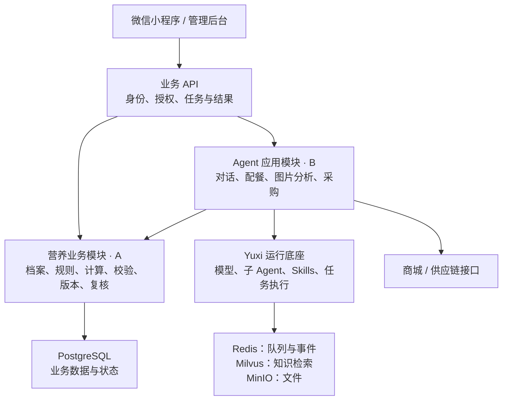

# 家庭营养师平台 Agent 模块划分与双人开发分工

## 1. 规划范围与分工原则

本规划基于现有 Yuxi 项目，覆盖家庭营养师平台一期的 Agent 能力与营养业务后端，包括家庭档案、成员授权、营养计算、配餐、饮食记录、专业复核和商城接口集成。

两人的主要分工为：

- **开发者 A：业务底座。** 负责数据、营养计算、业务校验、结果持久化与专业管理。
- **开发者 B：Agent 应用。** 负责 Agent 流程、模型与工具接入、知识检索、图片分析、客户端协议和商城集成。

本规划包含小程序及管理后台所需的接口，不包含完整客户端页面和商城系统从零建设。若这些工作也由两人承担，需要单独计入工作量并重新评估原定 45 天周期。

具体营养标准、适用人群、禁忌规则和专业审核意见，由指定专业人员提供或确认；开发人员负责将其实现为可执行、可测试的系统能力。

## 2. 整体系统架构

采用模块化单体架构，在现有 Yuxi 后端中增加营养业务模块，沿用 API 与独立 Worker 的部署方式。

架构约定：

1. 档案编辑、记录查询和订单查询等普通操作直接调用业务接口；需要理解、生成或分析的任务进入 Agent。
2. 采用一个家庭协调 Agent，按需调用知识、配餐和识别能力，复用 Yuxi 现有主子 Agent 机制。
3. 营养数值、单位换算和硬约束由业务服务计算与校验；Agent 负责理解、追问、规划和解释。
4. 用户端可展示任务进度，个体化建议通过校验后再发布。
5. AgentRun 执行状态、建议任务状态和交易状态分别管理。执行完成不自动表示建议审核通过。

## 3. 开发者 A 负责的模块

### A1 家庭、成员与授权

**实现功能：**

- 对接现有用户账号，建立用户、家庭、成员之间的关系。
- 实现家庭创建、成员邀请、加入、停用及照护关系管理。
- 区分家庭管理员、本人、照护人的操作权限。
- 保存授权对象、字段、用途、期限和撤回状态。
- 提供统一权限检查，供 API 和 Agent 工具调用。

**交付结果：**B 能够根据当前操作者和任务，获取被授权的成员数据；更换成员 ID、跨家庭调用等越权请求被拒绝。

### A2 健康档案与指标

**实现功能：**

- 基础信息：年龄、身高、体重、活动水平、健康目标。
- 健康信息：已知病史、用药、医嘱、过敏原、忌口。
- 家庭偏好：口味、预算、烹饪设备和可用时间。
- 指标记录：数值、单位、测量时间、来源及历史变化。
- 档案版本、确认时间、完整度与缺失项检查。

**交付结果：**提供结构化档案和缺失字段清单，让 B 据此追问；历史建议可以关联当时的档案版本。

### A3 专业数据与规则管理

**实现功能：**

- 食材库：营养成分、单位、可食部、生熟状态、过敏原、来源。
- 菜谱库：食材克数、调味、成品重量、做法、替换关系。
- 规则库：适用条件、排除条件、计算参数、硬约束和冲突策略。
- 专业知识的来源、适用人群、有效期及审核信息。
- 草稿、审核、发布、停用和版本管理。
- 提供专业管理后台所需的业务接口。

**交付结果：**系统能明确识别当前可用的知识、规则和菜谱版本。

**职责边界：**A 实现规则的表达和执行机制；具体营养标准由专业人员提供并审核。B 根据发布状态处理索引和检索。

### A4 营养计算与硬约束校验

**实现功能：**

- 计算个人每日营养目标。
- 计算菜谱、个人份量和实际摄入的营养结果。
- 处理采购重量、可食部、生重、熟重及单位换算。
- 汇总已确认饮食记录，计算当日差额和记录完整度。
- 校验过敏原、禁忌、适用范围和规则冲突。
- 对未知数据返回信息缺口，保存计算依据和输入版本。

**交付结果：**B 提交结构化输入后，获得可复算结果，以及“通过、待补充、待复核、阻断”的明确结论。

### A5 菜单、饮食记录与版本管理

**实现功能：**

- 保存营养目标、菜单草案、个人份量和计算结果。
- 菜单确认、替换、成员变化后创建新版本。
- 保存已确认饮食记录，支持更正、删除和汇总重算。
- 避免任务重试导致记录重复写入。
- 处理多人同时修改、旧版本确认等冲突。
- 提供历史查询及采购模块需要的已确认菜单。

**交付结果：**业务结果独立于聊天记录存在，能够持续查询、修改和追溯。

### A6 专业复核与业务审计

**实现功能：**

- 创建、分配、处理专业复核任务。
- 保存触发原因、相关版本、处理意见和审核人。
- 复核通过后形成新的有效结果。
- 记录授权变化、敏感访问、规则发布和结果确认。
- 提供专业复核工作台接口。

**交付结果：**需要人工处理的任务有明确负责人和处理结果，B 可以查询状态并继续后续流程。

## 4. 开发者 B 负责的模块

### B1 Agent 任务入口与运行流程

**实现功能：**

- 对接小程序的对话、配餐、图片分析等任务入口。
- 将业务任务关联到 Yuxi Request、Run 和当前用户。
- 通过 A 的权限服务，在服务端确定家庭、成员及任务作用域。
- 管理追问、等待确认、运行、失败和取消。
- 实现总时限、有限重试及降级处理。
- 返回统一任务进度和业务结果引用。

**交付结果：**客户端能提交任务、查看进度、回答追问，并在断线后恢复查询。

### B2 Agent 角色、Skills 与工具接入

**实现功能：**

- 建立家庭协调 Agent 和必要的专业子 Agent。
- 编写建档追问、配餐、图片分析、采购等 Skills。
- 把 A 提供的业务服务封装为模型可调用工具。
- 限定每个 Agent 的工具、知识和数据范围。
- 配餐 Agent 输出菜谱与份量候选，调用 A 的计算和校验。
- 保证授权、硬约束校验和确认步骤必经。
- 将结果组织成菜单卡片、补充问题或复核提示。

**交付结果：**Agent 能完成任务闭环，数值和业务状态来自受控工具。

### B3 专业知识检索

**实现功能：**

- 复用 Yuxi 的文档解析、分块、索引和检索。
- 接入 A 提供的发布状态、版本和适用范围。
- 返回原始来源、引用片段和知识版本。
- 过滤未发布、停用或不适用的内容。
- 知识更新后同步索引，并防止旧索引结果继续生效。
- 评估检索命中、依据完整性和引用准确性。

**交付结果：**Agent 获得可用、可追溯的专业依据。

**职责边界：**A 决定内容是否可用，B 负责如何准确检索。

### B4 拍照识别与饮食交互

**实现功能：**

- 图片上传与受控读取。
- 调用视觉模型，提取菜品、食材和做法候选。
- 组织用户确认：用料、调味、重量、个人食量。
- 关联已有菜单或标准菜谱。
- 调用 A 的工具进行营养估算。
- 用户确认后调用 A 保存正式记录。
- 识别失败时提供手动录入路径。

**交付结果：**打通“照片 → 候选 → 用户确认 → 摄入计算 → 饮食记录”。

### B5 采购与商城集成

**实现功能：**

- 从 A 的已确认菜单提取并合并食材需求。
- 扣减用户确认的家中库存。
- 使用统一换算能力计算采购量。
- 维护食材与 SKU、组合包的映射。
- 调用适用性校验，再按库存、配送、价格筛选。
- 对接购物车、订单查询、支付结果和售后接口。
- 处理缺货、价格变化、重复请求及状态不确定。

**交付结果：**菜单能够转换为可确认的采购方案，并追踪后续交易结果。

**职责边界：**B 拥有采购清单与商品映射逻辑；订单、支付、退款的最终状态由商城系统拥有。涉及替换菜谱或食材时，重新调用 A 的校验并取得用户确认。

### B6 结果交付、运行监控与部署

**实现功能：**

- 输出任务进度及校验通过后的结果。
- 对接菜单、图片确认、采购等客户端数据协议。
- 关联业务任务、Agent Run、工具调用和业务对象版本。
- 统计耗时、失败原因、模型用量和成本。
- 复用 Yuxi 部署体系，补充业务配置、告警和故障排查。
- 组织完整链路联调。

**交付结果：**用户能看懂任务状态，开发人员能定位问题和核对执行结果。

## 5. 交叉工作与责任边界

| 工作 | 主负责人 | 配合方式 |
|---|---|---|
| 家庭、档案、规则、菜单、饮食数据模型 | A | B 提供任务所需字段 |
| 营养计算与校验服务 | A | B 封装 Agent 工具 |
| 专业内容审核发布 | A | B 同步检索索引 |
| Agent 流程及模型输出结构 | B | A 确认业务约束 |
| 采购清单、SKU 映射和商城适配 | B | A 提供菜单、单位换算和营养校验 |
| 专业复核流程 | A | B 负责触发、通知和后续任务衔接 |
| 业务审计与历史版本 | A | B 写入运行关联信息 |
| Agent 日志、成本与部署 | B | A 配合数据库迁移和业务排查 |
| 端到端验收 | B 牵头 | A 核对权限、计算与最终落库结果 |

各自负责所属模块的接口、实现、测试和说明；另一人重点检查交叉接口与业务边界。公共数据结构、Agent 注册和数据库迁移等共享改动需提前协调。

## 6. 优先确定的接口契约

| 接口能力 | 提供方 | 核心返回 |
|---|---|---|
| 获取授权成员上下文 | A | 可用字段、档案版本、缺失项、授权范围 |
| 获取有效专业数据 | A | 知识、规则、菜谱及其发布状态和版本 |
| 计算营养目标与摄入 | A | 数值、单位、依据版本、未知项 |
| 校验菜单 | A | 通过、待补充、待复核或阻断，以及原因 |
| 保存与确认业务结果 | A | 菜单或记录 ID、版本、状态 |
| 创建及查询复核任务 | A | 复核任务 ID、处理状态、决定及结果版本 |
| 提交及查询 Agent 任务 | B | 任务 ID、Run ID、进度、业务结果引用 |
| 生成采购方案 | B | 净需求、商品候选、覆盖情况、待确认项 |

统一使用 `family_id`、`member_id`、`task_id`、业务对象版本和幂等键。家庭及成员 ID 必须经过服务端授权校验。

计算结果和校验结论采用结构化返回；模型说明文字与业务数据分别保存。接口样例同时覆盖正常、缺失、冲突、越权、版本变化和重复请求场景。

## 7. 开发配合顺序

| 阶段 | A 的重点 | B 的重点 | 联合验收点 |
|---|---|---|---|
| 基础阶段 | 档案、授权、数据结构、计算接口 | 任务入口、专用 Agent、工具包装 | Agent 能读取授权数据并正确追问 |
| 配餐阶段 | 规则、菜谱、营养计算、菜单版本 | 候选规划、校验分支、结果展示 | 完成一份可确认、可复算的家庭菜单 |
| 反馈阶段 | 饮食记录、更正重算、复核 | 图片识别、用户确认、下一餐建议 | 实际摄入能正确影响后续建议 |
| 交易阶段 | 菜单有效性、单位换算、适用性校验 | 采购、SKU、商城与异常处理 | 菜单到采购和真实订单贯通 |
| 验收阶段 | 权限、计算、版本与业务一致性 | 超时、重试、运行恢复与整体联调 | 正常及异常链路均有明确结果 |

最早需要共同完成的交付物是数据字典和接口契约。A 先提供固定样例和接口结构，B 即可并行搭建 Agent 流程；随后用真实服务逐步替换样例。

专业数据准备和商城接口联调应提前启动，避免成为后期阻塞项。

**关键路径：专业数据与规则 → 营养计算 → 配餐校验 → 完整业务闭环。**
